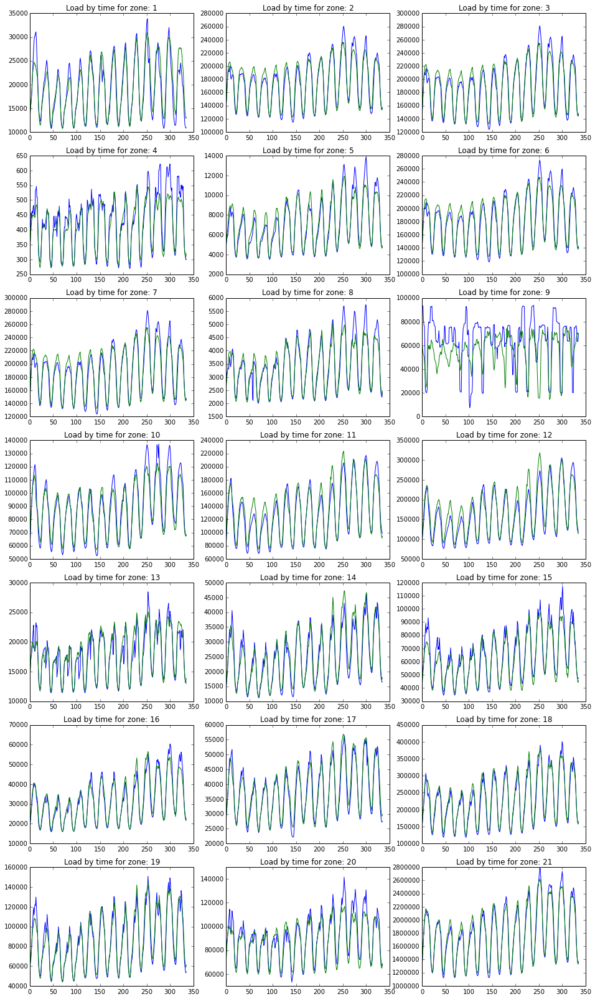

#  Time Series Analysis: Load Forecasting Track of Global Energy
Time series prediction project for IRDM(COMPGI15) 2016 @ UCL

Group 30 ([Yijing YANG](mailto:yijing.yang.15@ucl.ac.uk), [Xinyi HE](xinyi.he.15@ucl.ac.uk), [Ying WEN](mailto:ying.wen@cs.ucl.ac.uk))


## Models
* Stateful Recurrent Neural Network: [Link](./load_prediction_model_stateful_lstm.ipynb) (The details can be found in the ipython notebook)

To more intuitively and vividly illustrate the stateful LSTM model, the following figure shows the structure and processes of the stateful LSTM model: 


* XGBoost: [Link](./load_prediction_model_xgboost.ipynb)

## Results
The following figure is fitting and forecasting resluts of stateful LSTM model (3 layers LSTM with history load as input).  

Note, this figure shows model’s fitting and forecasting results from 17/06/2008 to 30/06/2008. In the first half, 17/06/2008 to 23/06/2008 is training fitting data; The second half from 24/06/2008 to 30/06/2008 is testing forecasting data. Besides, the blue line represents expected data and the green line represents predicted data and zone 21 is load sum of the other 20 zones.

To find more result figures, please check the [results folder](./results).




## Requirements
* Python 2.7
* Keras
* XGBoost

To install all the requirements:

```
pip install requirement.txt
```

## Dataset
* [Load Forecasting](https://www.kaggle.com/c/global-energy-forecasting-competition-2012-load-forecasting/data)
